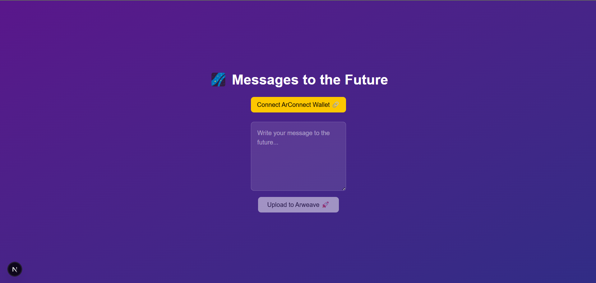

# 💜Humanity Archive - Upload Message to Arweave

**Humanity Archive** is a decentralized web application that allows users to write messages to the future and upload them to the Arweave blockchain using the ArConnect wallet extension.

## Gallery


## Features

- **Connect ArConnect Wallet**: Connect your ArConnect wallet to interact with Arweave.
- **Upload Messages**: Write messages and upload them to the Arweave blockchain.
- **View Uploaded Messages**: Once uploaded, the message is stored permanently on Arweave, and users can view the transaction by clicking on a link.

## Prerequisites

Before running the application, ensure you have the following:

- A **web browser** (Google Chrome, Firefox, etc.)
- **ArConnect wallet extension** installed in your browser ([ArConnect](https://www.arconnect.io/))
- **Node.js** (Recommended version: 16.x or later)
- **npm** or **yarn** (package managers)

## Setup & Installation

### 1. Clone the repository

```bash
git clone https://github.com/levanter914/Humanity-Archive-VibeCodingSubmission.git
cd Humanity-Archive-VibeCodingSubmission
```

### 2. Install dependencies

Run the following command to install the necessary packages:

```bash
npm install
```

or if you use `yarn`:

```bash
yarn install
```

### 3. Start the development server

To run the app locally:

```bash
npm run dev
```

or with `yarn`:

```bash
yarn dev
```

The app will now be running at [http://localhost:3000](http://localhost:3000).

### 4. Connect ArConnect Wallet

Once the app is running, click on **Connect ArConnect Wallet** to connect your wallet. Ensure you have the **ArConnect** extension installed and configured. Upon successful connection, your wallet address will be displayed.

### 5. Write and Upload a Message

- Write your message in the provided text area.
- Click the **Upload to Arweave** button to upload the message.
- After uploading, a link to view the transaction on Arweave will be shown.

## How It Works

1. **ArConnect Wallet**: The app communicates with your ArConnect wallet for interacting with the Arweave blockchain. The wallet handles permissions, signing transactions, and dispatching the transaction.
2. **Arweave**: The messages are uploaded to Arweave, a decentralized storage network, making the data immutable and permanently available.
3. **Transaction**: After the message is signed and dispatched, the transaction is recorded on Arweave, and a transaction ID is provided for future reference.

## Technologies Used

- **Frontend**: React, Tailwind CSS
- **Backend**: None (directly interacts with Arweave)
- **Wallet**: ArConnect (browser extension)
- **Blockchain**: Arweave

## Known Issues

- Make sure the **ArConnect wallet extension** is properly installed and configured before attempting to connect.
- Permissions may need to be granted within the ArConnect wallet to enable full functionality (access address, sign transactions, dispatch).
